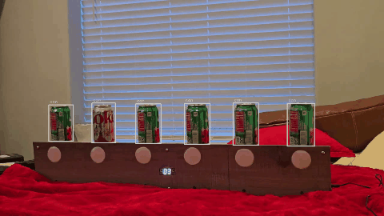
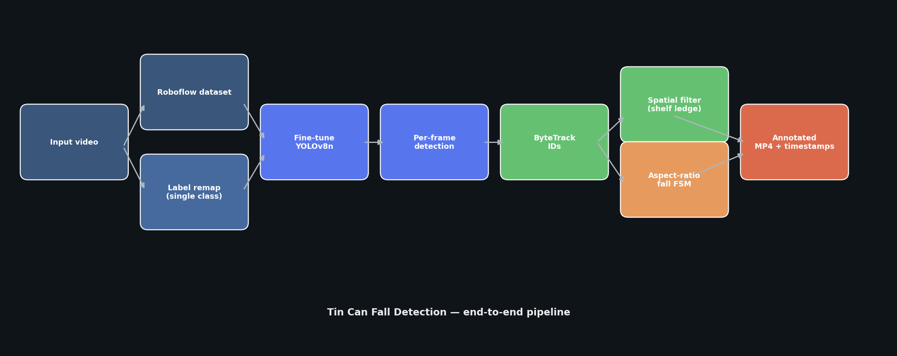
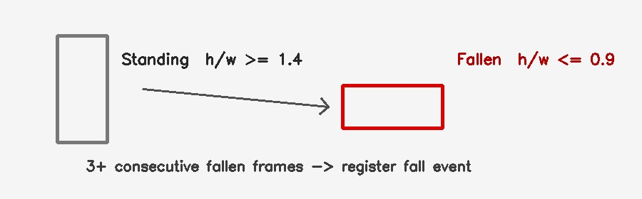
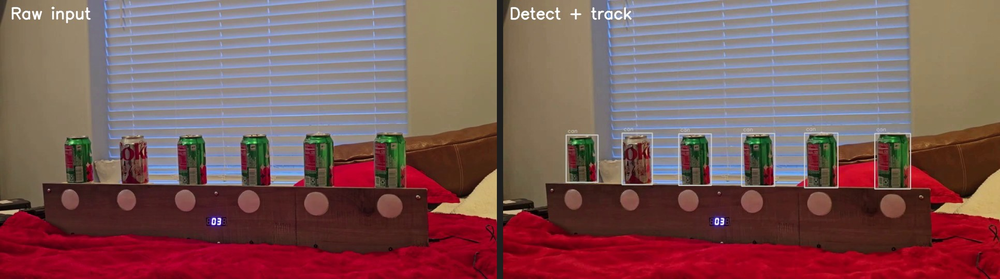
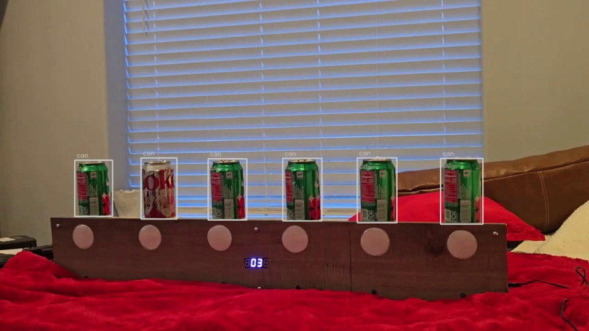
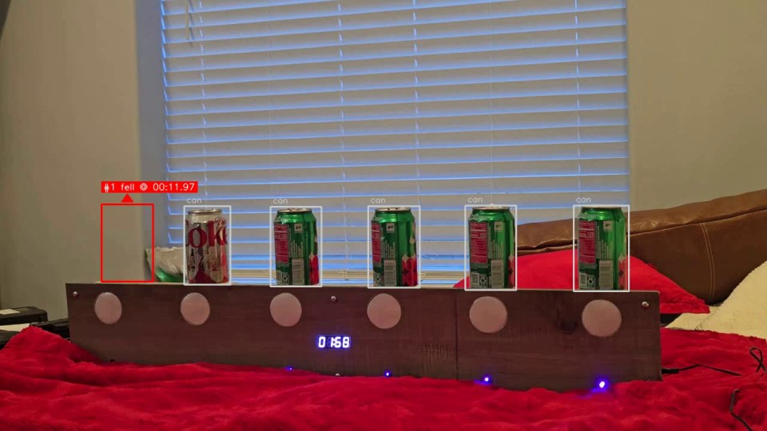
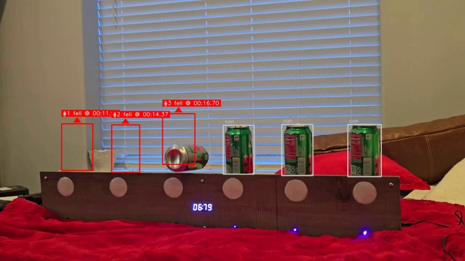
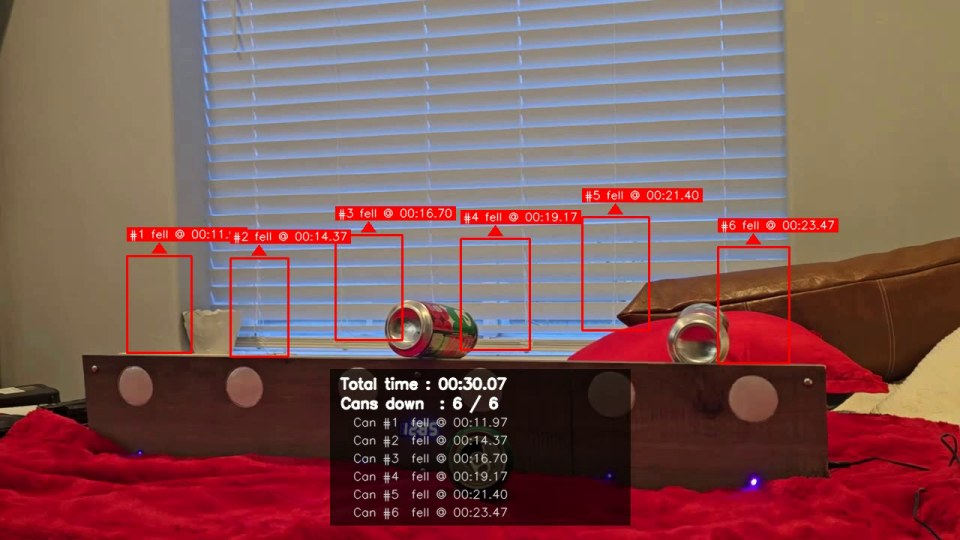

# Tin Can Fall Detection

Computer vision pipeline that detects soda cans on a shelf, tracks them through video, and records when each can falls — inspired by tin-can alley gameplay.

**Author:** [Omar Zayed](https://github.com/omarzyd)  
**Course:** Year 3 — Computer Vision

<p align="center">
  
</p>
<p align="center"><em>Annotated output: standing cans (grey), fallen cans (red + timestamp), end-of-clip summary.</em></p>

---

## Overview

This project combines **object detection**, **multi-object tracking**, and **geometry-based state reasoning** to automate fall counting from a single camera view.

| Stage | Method | Role |
|-------|--------|------|
| Detection | [YOLOv8n](https://docs.ultralytics.com/models/yolov8/) fine-tuned on can images | Locate cans per frame |
| Tracking | [ByteTrack](https://github.com/ifzhang/ByteTrack) (via Ultralytics) | Maintain stable can IDs |
| Fall logic | Bounding-box aspect ratio (`h/w`) | Distinguish standing vs tipped cans |
| Output | OpenCV overlay | Annotated MP4 with timestamps and summary |

On the reference clip (~30 s, 6 cans), the system detected **6 / 6** falls with sub-second timestamps.

---

## Pipeline

<p align="center">
  
</p>

| Step | What happens |
|------|----------------|
| 1 | Roboflow *Brand of Can Soda* export → all brands remapped to one `can` class |
| 2 | YOLOv8n fine-tuned (50 epochs, 640×640) |
| 3 | ByteTrack assigns a stable ID per can across frames |
| 4 | Spatial filter removes detections below the shelf ledge |
| 5 | Aspect-ratio state machine flags each fall (`h/w` thresholds + 3-frame sustain) |
| 6 | OpenCV renders boxes, fall markers, and a 5 s summary panel |

### Fall detection logic

<p align="center">
  
</p>

A can must appear **standing** (`h/w ≥ 1.4`) for several frames, then **fallen** (`h/w ≤ 0.9`) for at least 3 consecutive frames before a fall is logged. Cans that vanish late in the clip use a disappearance fallback.

---

## Outputs

### Input vs detection (baseline)

<p align="center">
  
</p>

### Standing → first fall → mid-game

<table>
  <tr>
    <td align="center"><b>All cans standing</b><br></td>
    <td align="center"><b>First fall registered</b><br></td>
  </tr>
  <tr>
    <td align="center" colspan="2"><b>Multiple falls in progress</b><br></td>
  </tr>
</table>

### End-of-clip summary

<p align="center">
  
</p>

The final **5 seconds** display total duration, `cans down / total`, and each fall time (`MM:SS.ss`).

---

## Results (validation)

| Metric | Value |
|--------|-------|
| mAP@50 | 0.995 |
| mAP@50–95 | 0.929 |
| Precision | 0.993 |
| Recall | 1.000 |

*Measured on the held-out validation split after single-class remapping.*

### Fall timestamps (reference run)

| Can | Time |
|-----|------|
| #1 | 00:11.97 |
| #2 | 00:14.37 |
| #3 | 00:16.70 |
| #4 | 00:19.17 |
| #5 | 00:21.40 |
| #6 | 00:23.47 |

Full methodology, evaluation, and discussion: [`docs/Report.pdf`](docs/Report.pdf).

---

## Repository structure

```
Computer-Vision-Project/
├── README.md
├── requirements.txt
├── LICENSE
├── notebooks/
│   └── tin_can_fall_detection.ipynb
├── docs/
│   ├── Report.pdf
│   └── images/              # README visuals (pipeline, frames, demo GIF)
├── data/
│   ├── README.md
│   ├── brand_of_can_soda.yolov8.zip   # local only
│   └── input_video.mp4                # local only
└── outputs/
    └── output_annotated.mp4           # generated
```

---

## Quick start

### 1. Clone and install

```bash
git clone https://github.com/omarzyd/Computer-Vision-Project.git
cd Computer-Vision-Project
python -m venv .venv
source .venv/bin/activate          # Windows: .venv\Scripts\activate
pip install -r requirements.txt
```

GPU recommended for training; inference runs on CPU (slower).

### 2. Add data

Follow [`data/README.md`](data/README.md):

- `data/brand_of_can_soda.yolov8.zip`
- `data/input_video.mp4`

### 3. Run the notebook

```bash
jupyter notebook notebooks/tin_can_fall_detection.ipynb
```

Run all cells top to bottom. The notebook auto-detects **local** vs **Google Colab** paths.

**Colab:** upload the two data files to `/content/data/`, enable a GPU runtime, then run.

### Key hyperparameters

| Parameter | Default | Purpose |
|-----------|---------|---------|
| `CONF` | 0.20 | Detection confidence threshold |
| `EPOCHS` | 50 | Training length |
| `ASPECT_STANDING` | 1.4 | Minimum `h/w` for “standing” |
| `ASPECT_FALLEN` | 0.9 | Maximum `h/w` for “fallen” |
| `SUSTAIN_FRAMES` | 3 | Consecutive fallen frames to confirm |
| `FORCE_RETRAIN` | `True` | Set `False` to reuse `weights/cans_v1/` |

---

## Tech stack

- [Ultralytics YOLOv8](https://github.com/ultralytics/ultralytics)
- [OpenCV](https://opencv.org/)
- [PyTorch](https://pytorch.org/)
- [ByteTrack](https://github.com/ifzhang/ByteTrack) (integrated in Ultralytics)

---

## Limitations

- Fall state is inferred from **2D box geometry**, not full 3D pose — extreme camera angles may affect aspect thresholds.
- Heavy occlusion or motion blur can break track IDs briefly.
- The validation split had label inconsistencies after remapping; training relied primarily on the train split.

---

## License

MIT — see [`LICENSE`](LICENSE).

---

## Acknowledgements

- Dataset: Roboflow *Brand of Can Soda* (YOLOv8 export)
- Base detector: Ultralytics YOLOv8n pretrained weights
